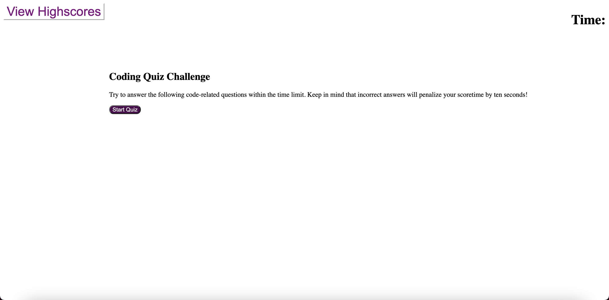

# Code-Quiz

Website: Code Quiz

This is a Code Quiz project for the University of Denver Coding Bootcamp. I wrote all of the code.

My assignment was as follows:

I WANT to take a timed quiz on JavaScript fundamentals that stores high scores
SO THAT I can gauge my progress compared to my peers

My Acceptance Criteria was as follows:

GIVEN I am taking a code quiz
WHEN I click the start button
THEN a timer starts and I am presented with a question
WHEN I answer a question
THEN I am presented with another question
WHEN I answer a question incorrectly
THEN time is subtracted from the clock
WHEN all questions are answered or the timer reaches 0
THEN the game is over
WHEN the game is over
THEN I can save my initials and my score

Explainations for the code are commented in the code.

